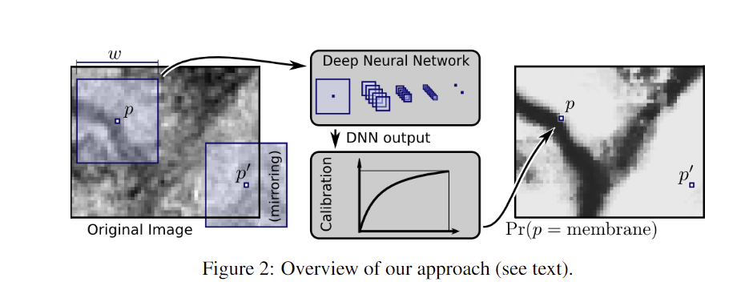
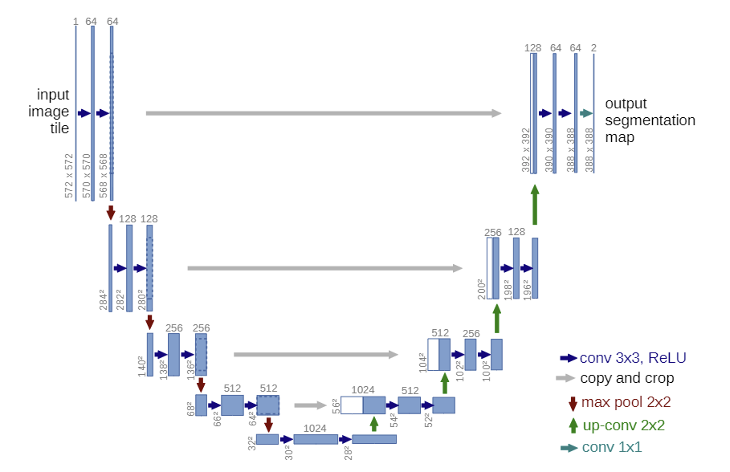

# U-Net
### Convolutional Networks for Biomedical Image Segmentation (2015)

one of the most influential papers in segmentation

### Abstract
- contracting path: captures context
- expanding path: precise localization
-----
### Introduction
- typical use of CNN is on classification tasks
- many visual tasks requires **localization**, which means that class label is supposed to be assigned to each pixel
- Each pixel is classified or mapped to certain labels
- Ciresan et al. used a sliding window approach and classified objects on a single pixel level, very expensive computational cost
  

#### Two Benefits of Ciresan's model
1. Enables localization
2. Training data in terms of patches is much larger than the number of training images

#### Two Drawbacks of Ciresan's model
1. Slow network, lot of redundancy due to overlapping patches
2. Trade-off between localization accracy and use of context (smaller the window, more localization, but less context)
-----
### Architecture

1. Contraction path
   - Input is a grayscaled 572 x 572 image
   - Learns 'What' is in the image, but loses 'Where' the entity is
2. Expansion path
   - Output has two layers of 388 x 388, because it has two classes (size is reduced due to the input padding)
   - Learns 'Where' the entity is
3. Skip Connections
   - Crop or pad the image from the contraction path to match the size

- No FC layers
- Only uses valid part of the convolution
- **Mirror padding**: Padded a mirror symmetry instead of zero padding, in order to mitigate boundary effects and preserve context
   - initial mirror padding reduces information loss in the copy&cropping step